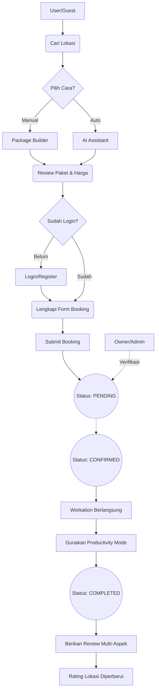

# 01. Project Overview

## 1. Tujuan Aplikasi
Aplikasi **GLOW (Gunungkidul Location for Work)** bertujuan untuk menyediakan sebuah platform digital terpusat yang memfasilitasi *remote worker* dan *digital nomad* dalam menemukan, merencanakan, dan memesan lokasi kerja sekaligus wisata (*workation*) di kawasan Gunung Kidul, Yogyakarta. Aplikasi ini juga bertujuan memberdayakan pemilik bisnis lokal (hotel, kafe, wisata) agar dapat menjangkau pasar pekerja jarak jauh secara efektif.

## 2. Masalah yang Diselesaikan
- **Tidak adanya informasi terpusat:** Wisatawan dan pekerja *remote* kesulitan menemukan informasi yang komprehensif terkait fasilitas kerja (seperti kecepatan WiFi dan ketersediaan colokan listrik) di destinasi wisata Gunung Kidul.
- **Kesulitan merencanakan itinerary *Workation*:** Belum ada *tools* yang mengintegrasikan perencanaan tempat menginap, tempat bekerja (workspace/cafe), dan aktivitas wisata dalam satu paket perjalanan.
- **Proses pemesanan yang terpisah-pisah:** Pemesanan penginapan, penyewaan *workspace*, dan tiket wisata biasanya dilakukan di platform yang berbeda.
- **Kesulitan menjaga produktivitas saat berlibur:** Pekerja *remote* sering kesulitan menyeimbangkan waktu kerja dan liburan tanpa *tools* manajemen waktu.

## 3. Target Pengguna
Aplikasi ini dirancang untuk melayani 3 aktor utama:
1. **USER (Remote Worker / Digital Nomad / Wisatawan):** Individu atau kelompok yang mencari tempat untuk bekerja sekaligus berlibur. Mereka membutuhkan informasi detail tentang konektivitas dan kenyamanan.
2. **OWNER (Pemilik Bisnis Lokal):** Pemilik penginapan, kafe/workspace, pengelola desa wisata, atau restoran di Gunung Kidul yang ingin mempromosikan tempatnya dan menerima pemesanan.
3. **ADMIN (Pengelola Platform):** Tim internal yang bertugas memvalidasi data bisnis, mengelola pengguna, dan memantau analitik platform secara keseluruhan.

## 4. Value Proposition
- **All-in-One Workation Platform:** Menyediakan *end-to-end service* mulai dari pencarian, pembuatan paket kustom, hingga pemesanan dalam satu aplikasi.
- **Detailed Connectivity Metrics:** Menampilkan data kecepatan WiFi aktual (Mbps) dan fasilitas colokan listrik secara transparan.
- **AI-Powered Recommendation:** Menggunakan kecerdasan buatan untuk menyusun paket perjalanan optimal berdasarkan preferensi *budget*, jumlah orang, dan *vibe* yang diinginkan.
- **Built-in Productivity Tools:** Menyediakan fitur Pomodoro *timer*, jurnal, dan pelacak *mood* untuk membantu pengguna tetap produktif selama *workation*.
- **Multi-Aspect Reviews:** Penilaian tidak hanya secara keseluruhan, tetapi spesifik pada kualitas WiFi, kenyamanan ruang kerja, dan suasana.

## 5. Workflow Aplikasi (High-Level)
1. **Discovery:** Pengguna mengakses platform untuk mencari lokasi berdasarkan kategori, harga, atau fasilitas.
2. **Planning:** Pengguna menggunakan fitur *Package Builder* (manual atau bantuan AI) untuk meracik paket perjalanan (Penginapan + Workspace + Wisata).
3. **Booking & Checkout:** Pengguna memesan paket yang telah dibuat dan menyelesaikan proses administrasi.
4. **Execution & Tracking:** Selama *workation*, pengguna memanfaatkan *Productivity Mode* (Pomodoro, Itinerary, Mood Tracker).
5. **Post-Workation:** Pengguna memberikan ulasan multi-aspek yang akan mempengaruhi *rating* lokasi di platform.

## 6. Fitur Utama
1. **Search & Filter Engine:** Pencarian lokasi dengan filter kategori (Penginapan, Workspace, Wisata, Kuliner, Budaya), harga, rating, dan metrik WiFi.
2. **Interactive Location Detail:** Halaman detail dengan galeri foto, daftar fasilitas, deskripsi, dan integrasi Google Maps interaktif.
3. **Package Builder:** *Cart system* khusus untuk merangkai beberapa entitas lokasi menjadi satu paket perjalanan kustom, dilengkapi dengan kalkulator harga otomatis.
4. **AI Assistant (Gemini):** Fitur *auto-generate* paket perjalanan menggunakan Google Gemini 2.5-flash berdasarkan *prompt* kondisi pengguna (teman perjalanan, suasana, *budget*).
5. **Booking System:** Alur pemesanan terintegrasi dengan validasi formulir dan pelacakan status pesanan (*Pending, Confirmed, Completed*).
6. **Productivity Mode:** Fitur manajemen waktu (Pomodoro), pembuatan jadwal harian (*Itinerary Planner*), dan pencatatan *mood/experience log*.
7. **Multi-dimensional Review:** Sistem ulasan terpisah untuk *Overall, WiFi, Workspace*, dan *Ambience* yang otomatis mengkalkulasi ulang *rating* lokasi.
8. **Role-based Dashboards:** Panel kontrol yang berbeda untuk User (Riwayat, Favorit), Owner (CRUD Lokasi, Statistik), dan Admin (Manajemen User, Verifikasi, Statistik Global).
9. **Authentication System:** Pendaftaran dan *login* aman menggunakan JWT dan *password hashing* (Bcrypt).
10. **Favorites:** Fitur untuk menyimpan lokasi (wishlist) dengan notifikasi *badge real-time*.

## 7. Fitur Tambahan
- Live form validation (memvalidasi format nama dan email saat diketik).
- Auto-detect URL API (beradaptasi secara otomatis antara *environment* lokal dan *production*).
- Responsivitas *mobile* dengan *drawer menu* dan navigasi bawah (*bottom nav*).
- Status publikasi lokasi (*Publish/Unpublish toggle*) untuk Owner/Admin.

## 8. Business Flow

