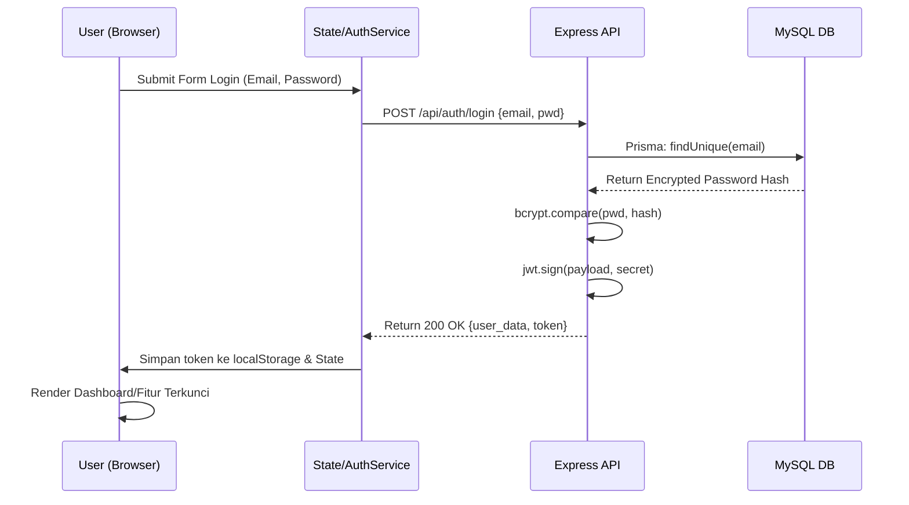
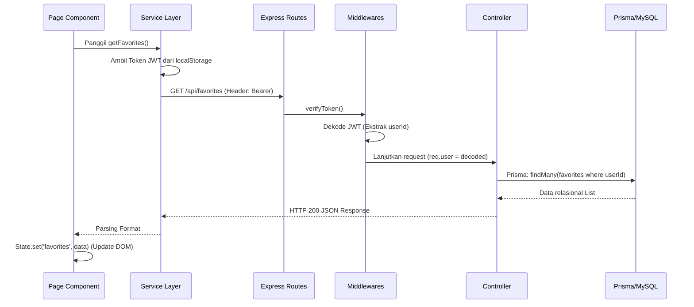

# 04. Arsitektur Sistem

Dokumen ini menganalisis struktur arsitektur proyek **GLOW**, mencakup pola desain (*design pattern*), pemisahan *frontend* dan *backend*, aliran data, hingga arsitektur *deployment*.

## 1. Arsitektur Frontend
Aplikasi klien GLOW beroperasi sebagai **Single Page Application (SPA)** yang tidak menggunakan *framework* besar (seperti React/Vue). Halaman dirender secara dinamis melalui modifikasi DOM (Document Object Model) berdasarkan perubahan *hash* URL.

- **Routing:** Mekanisme navigasi ditangani oleh pendengar kejadian (`window.onhashchange`) di dalam `client/js/app.js`. Berdasarkan parameter *hash* (misal `#booking`), fungsi *router* akan memanggil fungsi komponen halaman yang relevan (seperti `renderBookingPage()`).
- **State Management:** GLOW mengimplementasikan **Observer Pattern** (*client/js/state.js*). Setiap variabel global (seperti `user`, `favorites`, `package`) dibungkus oleh objek `State`. Komponen UI dapat "berlangganan" (*subscribe*) ke suatu data. Jika data tersebut berubah (menggunakan `State.set`), semua fungsi pendengar akan terpicu secara otomatis (*notify*).
- **Service Layer:** Akses ke *backend API* dipisahkan dari lapisan antarmuka pengguna (UI). Folder `client/js/services/` berisi abstraksi (menggunakan `fetch`) yang menangani *request* dan *response*, mengatur token otorisasi secara otomatis dari `localStorage`, dan mengonversi format JSON.

## 2. Arsitektur Backend
Layanan sisi *server* menggunakan kerangka kerja **Express.js** yang menerapkan pola arsitektur **MVC (Model-View-Controller) / Route-Controller Pattern**.

- **Routing Layer:** Mengarahkan rute spesifik (*endpoints*) ke dalam berkas direktori grup. Contoh: Semua URL yang diawali `/api/auth` akan dilempar ke `server/routes/auth.routes.js`.
- **Middleware Layer:** Rantai pencegatan permintaan (sebelum *Controller* dijalankan). Meliputi `cors()`, pembaca JSON (`express.json()`), penangan otentikasi JWT (`verifyToken`), penjaga otorisasi hak akses (*Role-based* `requireRole`), dan fungsi memproses berkas (`upload.single('image')`).
- **Controller Layer:** Menjalankan logika komputasi utama, melakukan validasi bisnis lanjutan dari *request*, dan merespons kembali dengan objek JSON yang matang.
- **Data Model Layer (Prisma ORM):** Interaksi terhadap pangkalan data relasional (MySQL) diabstraksi secara deklaratif menggunakan *Prisma Client* yang terhubung sesuai skema struktur `prisma/schema.prisma`.

## 3. Struktur Direktori Folder (Folder Tree)
Secara keseluruhan, proyek berstruktur monolitik logis (kode *client* dan *server* berada dalam satu repositori).

```
GLOW/
│
├── client/                     # Lapisan Frontend (Statik)
│   ├── css/                    # Penataan gaya (main.css)
│   ├── images/                 # Berkas gambar statis
│   ├── js/                     # Logika klien
│   │   ├── services/           # Abstraksi pemanggilan API (11 file)
│   │   ├── app.js              # Inisialisasi utama & Router
│   │   ├── components.js       # Komponen UI global (Navbar, Auth Modals, Form)
│   │   ├── config.js           # Resolusi deteksi alamat API (Local vs Prod)
│   │   ├── data.js             # Data statis & utilitas format
│   │   ├── state.js            # Mekanisme State Management (Observer)
│   │   └── page-*.js           # Fungsi pembangun Halaman UI (10 file)
│   └── index.html              # Titik masuk (Entry point) SPA
│
├── server/                     # Lapisan Backend (REST API)
│   ├── controllers/            # Modul logika bisnis (10 file)
│   ├── middlewares/            # Penanganan otentikasi & file upload (2 file)
│   ├── routes/                 # Peta rute (URL Endpoints) (10 file)
│   ├── uploads/                # Direktori penyimpanan gambar lokal (dinamis)
│   ├── app.js                  # Pendaftaran rute dan layanan middleware Express
│   └── server.js               # Berkas utama pelaksana Node.js pendengar Port
│
├── prisma/                     # Konfigurasi ORM Database
│   ├── schema.prisma           # Pemetaan skema entitas database (11 tabel)
│   └── seed.js                 # Skrip pengisi (Seeder) data awal otomatis
│
├── database/                   # Direktori arsip
│   └── glow_db.sql             # Ekspor pangkalan data MySQL mentah
│
├── .env.example                # Templat rahasia lingkungan (Environment Variables)
├── package.json                # Daftar modul dependensi eksternal
└── README.md                   # Dokumentasi panduan
```

## 4. Diagram Aliran Data (Data & Request Flow)

### a. Aliran Otentikasi (Authentication Flow)



### b. Aliran Permintaan Data (Request-Response Flow)



## 5. Arsitektur Penyimpanan & Deployment (Deployment Architecture)

Meskipun secara konseptual terpisah, proyek direkayasa sedemikian rupa agar dapat di-deploy sebagai layanan tunggal terpadu (*monolith*).

- Berkas **server/app.js** memiliki fungsi penangkap-semua (*SPA Catch-all*) dan modul pelayanan statis (`express.static`). Hal ini memungkinkan `node server/server.js` untuk menjalankan REST API di rute `/api/*`, sekaligus meng-hosting seluruh isi folder `client/` di bawah *domain* dasar `/`.
- Skema ini memungkinkan *deployment* gratis dengan sangat mudah di infrastruktur komputasi *cloud* (*seperti Render.com*), di mana lingkungan hanya butuh menjalankan 1 baris perintah (mengeksekusi 1 peladen web).
- Penyimpanan gambar di-hosting secara statis, dengan struktur tautan absolut dikembalikan lewat API (`/uploads/foto_x.jpg`).

```mermaid
graph TD
    subgraph Render.com [Render Cloud Environment]
        Node[Node.js Server Port 3001]
        
        subgraph Express Application
            API[REST API Routes /api/*]
            Static[Static Server]
            Fallback[SPA Fallback (*)]
        end
        
        Node --> API
        Node --> Static
        Node --> Fallback
        
        Static -.->|Melayani Berkas| C[Folder client/]
        Fallback -.->|Redirect| I[client/index.html]
    end

    subgraph Aiven/TiDB [Cloud Database Environment]
        MySQL[(MySQL Database)]
    end

    API <-->|Prisma ORM over TCP| MySQL
```
