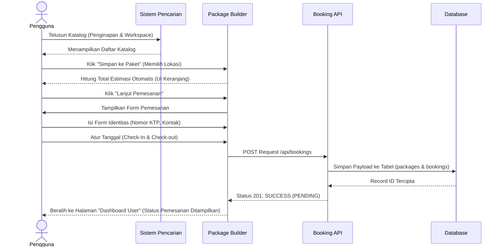

# 05. Proses Bisnis (Business Process)

Bagian ini memodelkan aliran logis dan proses operasional fitur aplikasi dari kacamata fungsional atau layanan pengguna. Berikut adalah 12 Proses Bisnis yang berjalan di aplikasi GLOW.

## 1. Proses Registrasi (User & Owner)
- **Aktor:** Calon Pengguna, Sistem.
- **Kondisi Memicu (Trigger):** Pengguna menekan tombol "Daftar Sekarang".
- **Aturan Bisnis:** 
  1. Validasi sinkron format *email* (Regex).
  2. Validasi pencegahan input angka/simbol pada field `Nama`.
  3. Panjang `Password` minimal 6 karakter.
  4. Pengecekan duplikasi `Email` secara server-side.
  5. Bila pendaftar memilih *role* `OWNER`, sistem akan membuat entitas tabel `BusinessProfile` dengan status dasar `PENDING`.
- **Output:** Pendaftaran berhasil (status 201), token JWT dikembalikan, Pengguna otomatis masuk dan diarahkan ke *Dashboard* utama.

## 2. Pencarian dan Filter Lokasi
- **Aktor:** Pengguna (Tidak login) / Pengguna (Login).
- **Alur Proses:**
  1. Pengguna membuka halaman "Cari" (beranda).
  2. Sistem mengirim HTTP `GET` ke `/api/locations`.
  3. Tampilan merender puluhan kartu tempat (HTML Dinamis).
  4. Pengguna memanipulasi rentang harga (Slider Rp.0 - 2 Juta), memilih kategori `Workspace`, dan menekan "Terapkan".
  5. Antarmuka sisi-klien (*Frontend*) memfilter secara asinkron dari larik daftar (array filtering) berdasarkan kriteria, lalu menggambar ulang DOM untuk tempat yang tersisa.
- **Aturan Bisnis:** Kriteria WiFi Speed diterapkan sebagai variabel minimum. Harga merupakan nilai batas ganda. 

## 3. Proses Package Builder (Kustom)
- **Aktor:** Pengguna (Login).
- **Trigger:** Menekan tombol "Tambahkan ke Paket" pada halaman detail lokasi, dan membuka menu "Susun Paket".
- **Alur Proses:**
  1. Keranjang kerangka memuat daftar entitas *Penginapan* (Hotel), *Workspace*, dan jenis Transportasi.
  2. Sistem menghitung akumulasi harga secara otomatis (Total Estimasi = Jumlah Malam * Harga Penginapan + Harga Transport + Harga Wisata).
  3. State `package` akan diperbarui secara reaktif menggunakan modul *Observer Pattern*.
  4. Pengguna menyimpan konfigurasi paket ke *Database* (tabel `saved_packages`), atau langsung beralih (Proceed) ke proses Pemesanan (Booking Checkout).
- **Pengecualian:** Harus login untuk tahap menyimpan atau melangkah ke *Booking*.

## 4. Rekomendasi AI (Generate Package)
- **Aktor:** Pengguna (Login), Gemini AI (Pihak Ketiga).
- **Input:** Preferensi teman perjalanan (sendiri/pasangan/keluarga), label anggaran (Budget/Premium), gaya suasana (vibe tenang/ramai).
- **Alur Proses:**
  1. Frontend mengirim data form input.
  2. *Controller* AI menarik katalog lokasi dasar dari DB.
  3. Sistem menyusun *Prompt* kompleks dan merangkai data katalog (ke format yang diminimalkan).
  4. Sistem mengirimkan *Request* ke LLM Google Gemini.
  5. Menerima *response* berupa *JSON Murni* berisi relasi *ID lokasi* terpilih dan satu kalimat analisis rekomendasi.
  6. Keranjang *Package Builder* diperbarui (Auto-Fill) otomatis berdasarkan ID lokasi yang dipilih AI.
- **Exception:** Bila API Gemini gagal memberikan format JSON murni, sistem melempar pesan galat agar pengguna mengulangi proses.

## 5. Proses Pemesanan (Booking Checkout)
- **Aktor:** Pengguna (Login), Sistem.
- **Input:** Validasi Identitas (Nama Asli, KTP, Telepon darurat) + Tanggal Check-In dan Jumlah Tamu.
- **Alur Proses:**
  1. Sistem menyimpan entitas rekam medis (KTP/Telepon) ke profil pengguna jika belum ada `user_profiles`.
  2. Tabel referensi dinamis `packages` dibuat secara spesifik dengan menyuntikkan (serialize JSON) variabel keranjang belanja.
  3. Entitas tabel `bookings` mencatat relasi dengan total perhitungan (`totalPrice`) dan men-set variabel status menjadi `PENDING`.
- **Output:** Struk halaman konfirmasi Pemesanan muncul.

## 6. Productivity Mode (Pomodoro & Itinerary)
- **Aktor:** Pengguna (Login).
- **Prasyarat:** Pengguna harus memiliki *Booking* minimal satu yang terkait dirinya.
- **Alur Proses:**
  1. Pengguna membuka mode *Productivity* dan memilih pesanan.
  2. **Itinerary:** Pengguna mencatat alokasi waktu kegiatan (`timeSlot`), sistem memasukkan baris baru di tabel `itineraries`.
  3. **Pomodoro Timer:** Sistem menjalankan pengatur mundur waktu statis sisi-klien 25 Menit Kerja, 5 Menit istirahat, mengaktifkan peringatan lonceng (*Bell Alarm*).
  4. **Mood Tracking:** Di akhir hari, pengguna mengisi skala mental 1-5 Bintang (*Mood Tracker*) dan keterangan harian yang akan masuk ke tabel `experience_logs`.

## 7. Proses Review Multi-Aspek
- **Aktor:** Pengguna (Login).
- **Prasyarat:** Hanya berlaku bila `booking_id` adalah milik pengguna, belum direview sebelumnya.
- **Input:** 4 skala indikator (Overall, WiFi, Workspace Comfort, Ambience) dengan rentang 1-5 bintang, dan catatan kualitatif (opsional).
- **Alur:** 
  1. Pengguna memberikan *rating*.
  2. Baris tabel `reviews` tercipta.
  3. Sistem otomatis melakukan Agregasi (*Calculate Average*) nilai seluruh `reviews` tempat tersebut di atas basis data.
  4. Tabel `locations` kolom *rating* (Total Rata-rata bintang) otomatis diperbarui (Sinkronisasi nilai performa ulasan).

## 8. Verifikasi Pemilik Bisnis (Admin Action)
- **Aktor:** Admin.
- **Input:** Mengubah Status dari Panel *Dashboard Admin*.
- **Alur Proses:**
  1. Admin meninjau data pengguna dengan *role* OWNER yang terdaftar.
  2. Klik Verifikasi. Permintaan dikirim ke `/api/admin/business/status`.
  3. `BusinessProfile.status` berubah menjadi `VERIFIED`.
- **Aturan Bisnis:** Hanya pemilik bisnis dengan status `VERIFIED` (bukan PENDING) yang mungkin diizinkan sistem untuk merender kartu dan lokasi paket secara publik.

## Diagram Bisnis Proses Utama: Alur Pemesanan Kustom

