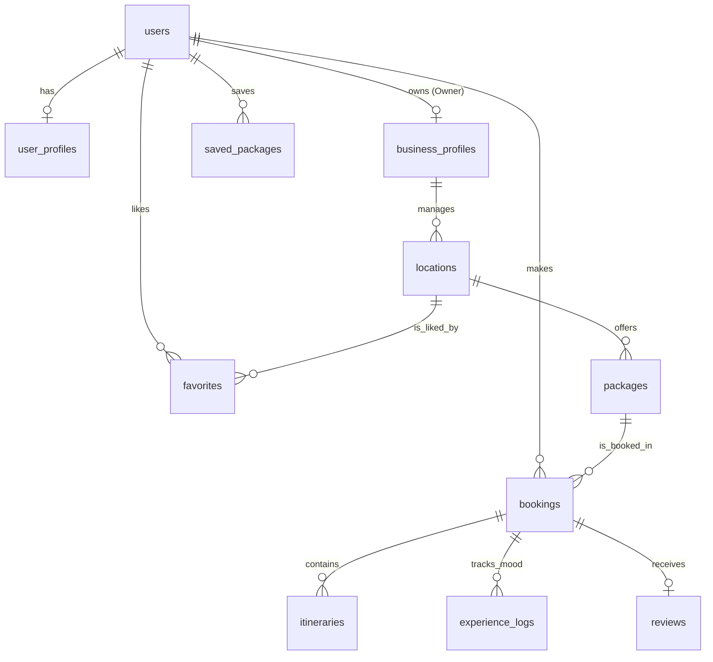

# 07. Analisis Basis Data (Database Analysis)

Dokumen ini memaparkan rancangan basis data relasional sistem **GLOW**, berbasis pada skema migrasi **Prisma ORM** (`prisma/schema.prisma`).

## 1. Pemodelan Data Konseptual (Conceptual Data Model)
Aplikasi GLOW berkisar pada tiga domain entitas utama:
- **Domain Pengguna (User Management):** Terdiri dari data akun otentikasi (`users`), kelengkapan profil biografi (`user_profiles`), serta ekstensi profil bisnis khusus mitra/pemilik (`business_profiles`).
- **Domain Inventaris (Catalog & Location):** Kumpulan daftar tempat pariwisata atau bisnis (`locations`) yang memuat rincian paket harga per layanan (`packages`).
- **Domain Transaksi (Order & Log):** Rangkuman reservasi pesanan pelanggan (`bookings`) yang memiliki rantai relasi aktivitas tambahan: jadwal rutinitas (`itineraries`), jurnal suasana hati (*mood tracking* di `experience_logs`), serta penilaian ulasan pasca-transaksi (`reviews`). Selain itu, sistem menyimpan keranjang pradesain milik pelanggan (`saved_packages`) dan interaksi sosial primitif favorit lokasi (`favorites`).

## 2. Pemodelan Data Fisik (Physical Data Model & Data Dictionary)
Sistem didefinisikan dalam basis data **MySQL**. Tabel memiliki standar `id` INT AUTO_INCREMENT sebagai kunci utama (Primary Key / PK).

### Tabel `users`
| Kolom | Tipe Data (MySQL) | Atribut & Constraint | Deskripsi |
|---|---|---|---|
| id | INT | PK, AUTO_INCREMENT | Identifier unik akun |
| fullName | VARCHAR(100) | NOT NULL | Nama Lengkap |
| email | VARCHAR(100) | UNIQUE, NOT NULL | Alamat surel log masuk |
| password | VARCHAR(255) | NOT NULL | Hash Kata Sandi (*Bcrypt*) |
| role | ENUM | DEFAULT 'USER' | ('USER', 'OWNER', 'ADMIN') |
| createdAt | DATETIME | DEFAULT CURRENT_TIMESTAMP | Tanggal pendaftaran |

### Tabel `user_profiles`
Ekstensi kelengkapan data diri `USER`.
| Kolom | Tipe Data | Atribut & Constraint | Deskripsi |
|---|---|---|---|
| id | INT | PK, AUTO_INCREMENT | Identifier profil |
| userId | INT | FK, UNIQUE | Kaitan 1:1 terhadap `users.id` |
| phoneNumber | VARCHAR(20) | NULL | Kontak Telepon |
| address | TEXT | NULL | Alamat Domisili |
| identityNumber | VARCHAR(50) | NULL | Nomor Identifikasi KTP/Paspor |
| emergencyContact | VARCHAR(100) | NULL | Kontak kondisi Darurat |

### Tabel `business_profiles`
Ekstensi legalitas akun bertipe `OWNER`.
| Kolom | Tipe Data | Atribut & Constraint | Deskripsi |
|---|---|---|---|
| id | INT | PK, AUTO_INCREMENT | Identifier profil bisnis |
| userId | INT | FK, UNIQUE | Kaitan 1:1 terhadap `users.id` |
| businessName | VARCHAR(150) | NOT NULL | Nama perusahaan / entitas mitra |
| status | ENUM | DEFAULT 'PENDING' | Approval: PENDING, VERIFIED, REJECTED |

### Tabel `locations`
| Kolom | Tipe Data | Atribut & Constraint | Deskripsi |
|---|---|---|---|
| id | INT | PK, AUTO_INCREMENT | Identifier Tempat |
| businessId | INT | FK | Relasi pemilik (`business_profiles.id`) |
| isPublished | BOOLEAN | DEFAULT TRUE | Visibilitas properti ke publik |
| name | VARCHAR(100) | NOT NULL | Nama tempat / destinasi |
| category | VARCHAR(50) | NOT NULL | Kategori (Penginapan/Workspace dll) |
| address | TEXT | NOT NULL | Jalan spesifik |
| latitude | DECIMAL(10,8) | NOT NULL | Titik Y Peta Posisional (Sangat Akurat) |
| longitude | DECIMAL(11,8) | NOT NULL | Titik X Peta Posisional (Sangat Akurat) |
| wifiSpeed | INT | NOT NULL | Metrik Kecepatan Internet (Mbps) |
| hasPowerOutlet | BOOLEAN | DEFAULT TRUE | Boolean ketersediaan colokan listrik |
| description | TEXT | NOT NULL | Teks Paragraf Promosi |
| img | VARCHAR(255) | NULL | Direktori/Path lokal file (.jpg) |
| rating | DECIMAL(3,1) | DEFAULT 0.0 | Nilai kumulatif ter-kalkulasi |
| reviews | INT | DEFAULT 0 | Counter banyaknya ulasan |
| facilities | JSON | NULL | Array Teks: ["AC", "Parkir"] |
| suasana | JSON | NULL | Array Teks: ["Tenang", "Asri"] |

### Tabel `packages` (Skema Harga Paket)
| Kolom | Tipe Data | Atribut & Constraint | Deskripsi |
|---|---|---|---|
| id | INT | PK, AUTO_INCREMENT | Identifier Harga Sub-Lokasi |
| locationId | INT | FK, NULL | Terikat pada `locations.id` |
| packageName | VARCHAR(100) | NOT NULL | Label Nama Paket (Custom/Asli) |
| pricePerDay | DECIMAL(12,2) | NOT NULL | Skala tarif |
| customData | JSON | NULL | Serialisasi Keranjang Cart (Custom) |

### Tabel `bookings` (Pesanan / Invoice)
| Kolom | Tipe Data | Atribut & Constraint | Deskripsi |
|---|---|---|---|
| id | INT | PK, AUTO_INCREMENT | Nomor Invoice Booking |
| userId | INT | FK | Terikat pada Pemesan `users.id` |
| packageId | INT | FK | Terikat pada Harga `packages.id` |
| startDate | DATE | NOT NULL | Estimasi Check-In |
| endDate | DATE | NOT NULL | Estimasi Check-Out |
| guestCount | INT | DEFAULT 1 | Angka jumlah teman penginap |
| totalPrice | DECIMAL(12,2) | NOT NULL | Biaya Pembayaran Absolut Keseluruhan |
| status | ENUM | DEFAULT 'PENDING' | Status Konfirmasi (PENDING, CONFIRMED, COMPLETED, CANCELLED) |

### Tabel Terkait Produktivitas (Relasi N:1 `bookings`)
- **`itineraries`:** Data pencatatan agenda di aplikasi, menampung `dayNumber` (Hari ke-X), `activityName`, `timeSlot` (Tipe Waktu/DATETIME), dan status filter Boolean produktif (`isProductivity`).
- **`experience_logs`:** *Mood Tracker*. Pencatatan harian `moodScore` (1-5 TINYINT) beserta Jurnal `note` (TEXT), dilengkapi penanda waktu pencatatan log otomatis `loggedAt`.

### Tabel Aksi Sosial & Ulasan (Relasi N:1 `users`)
- **`reviews`:** Ulasan evaluatif pasca-booking. Memuat relasi FK 1:1 ke tabel Booking (kolom `bookingId` bernilai UNIQUE). Menyimpan multi-dimensi TINYINT: `rating`, `wifiRating`, `workspaceRating`, dan `ambienceRating` dengan teks `comment`.
- **`favorites`:** Data tombol klik penanda Hati. Terkunci ganda dengan constraint indeks khusus: `@@unique([userId, locationId])` (1 Baris per pengguna per tempat).
- **`saved_packages`:** *Wishlist Checkout / Cart Package*. Data `name` (Label Pribadi) dan `packageData` JSON utuh keranjang sebelum dibayarkan ke Booking.

## 3. Analisis Normalisasi Basis Data
Skema yang dideklarasikan oleh Prisma mengikuti prinsip **Bentuk Normal Ketiga (3NF - Third Normal Form)**:
1. **1NF:** Setiap atribut bernilai atomik (kecuali pemanfaatan tipe data array khusus `JSON` pada `facilities` / `suasana` demi optimasi peramban UI tanpa tabel relasional ekstra). 
2. **2NF:** Memiliki kunci pengidentifikasi (PK `id`) eksplisit. Semua atribut bergantung pada pengidentifikasi. 
3. **3NF:** Memisahkan data biografi yang *nullable* ke entitas sekunder (`user_profiles` dan `business_profiles`) untuk menjaga kebersihan relasi (Dependensi Transitif tidak terjadi di dalam tabel sentral `users`).

## 4. Entity Relationship Diagram (ERD)

