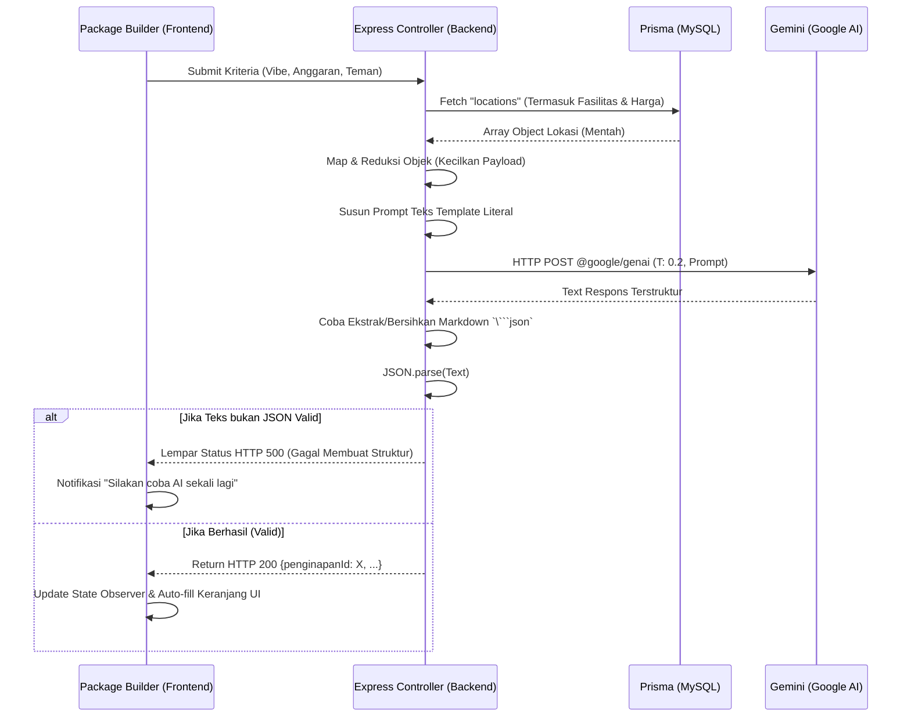

# 09. Analisis Model Bahasa Kecerdasan Buatan (LLM - Gemini API)

Sebagai fitur yang menambah *Value Proposition*, aplikasi **GLOW** menyertakan utilitas kecerdasan buatan terapan (*Applied AI*) yang berfungsi sebagai Agen Travel Pribadi Kustom. Logika integrasinya tertanam di `server/controllers/ai.controller.js`.

## 1. Landasan Pemilihan Teknologi LLM
- **Mengapa memerlukan LLM?** Aplikasi pariwisata (*OTA/Online Travel Agent*) tradisional memerlukan pengguna melakukan pemilihan *puzzle* jadwal secara terpisah. Filter biasa hanya menyaring data yang ada, tidak dapat **meracik atau menyusun kombinasi harga silang (cross-referencing)** paket akomodasi, ruang kerja, kendaraan, serta atraksi wisata agar sesuai dengan skenario (contoh: kriteria *Budget*, bersama *Keluarga*, nuansa *Tenang/Asri*) dalam batasan perhitungan Matematika Kalkulus Total.
- **Vendor & SDK:** Digunakan antarmuka generasi baru **Google Gemini API** (`@google/genai`) dengan kapabilitas penarikan *Flash*. Model berbiaya rendah dan sangat reaktif.
- **Nama Model Operasional:** `gemini-2.5-flash`

## 2. Arsitektur Prompt Engineering & Flow AI
Teknik konstruksi yang diterapkan pada *Backend Node.js* menggunakan gaya **Zero-Shot Prompting dengan Penyisipan Konteks Database Terbatas (RAG-lite)**.

### a. Ekstraksi Konteks (Database to JSON)
Backend melakukan iterasi dan meringkas seluruh tabel `locations` & harganya (`packages`). Properti direduksi agar tidak melanggar batas (Token limit Context-Window Gemini). 

```javascript
const catalog = locations.map(loc => ({
   id: loc.id, name: loc.name, category: loc.category,
   price: loc.packages.length > 0 ? parseFloat(loc.packages[0].pricePerDay) : 0,
   suasana: loc.suasana || [], rating: parseFloat(loc.rating), facilities: loc.facilities
}));
```

### b. Penyusunan Sistem Prompt
Prompt dirancang tertutup dengan batasan format *output*.

> **Tugas Anda:** 
> Pilih HANYA 1 Penginapan, 1 Workspace (atau Cafe), 1 Transportasi, 1 Wisata, dan 1 Kuliner/Budaya dari data katalog JSON di bawah ini yang paling cocok dengan kriteria pelanggan:
> - Berlibur dengan: `[Teks dari User]`
> - Suasana yang dicari: `[Teks dari User]`
> - Kategori Budget: `[Label]` (Maksimal Rp `[Limit]`)
>
> Total harga kelima tempat/layanan (dihitung dari field 'price') TIDAK BOLEH melebihi Budget Maksimal.
> Output HARUS berupa format JSON murni TANPA ada tag markdown.

## 3. Parameter Eksekusi Model
- **Temperature:** Ditetapkan secara statis di `temperature: 0.2`.
- **Alasan Modifikasi:** Standar Gemini (Seringkali `0.7-1.0`) sangat berhalusinasi dan puitis (variatif). Karena di sini sistem mewajibkan perhitungan matematika ketat dan kewajiban mengulang format JSON ID, rentang suhu **0.2** (Rendah) mengunci Gemini agar lebih logis (*Factual/Deterministic*), mengesampingkan kreatifitas.

## 4. Sistem Penanganan Error & Fallback String Parsing
Dikarenakan LLM Gemini (walaupun diperintahkan sebaliknya) sering menyisipkan *Markdown Code Blocks* di sekitar respons teks, logika backend menyediakan rutinitas pembersihan *string* (*Fallback Regex Parser*):

```javascript
let cleanJson = aiText.trim();
// Fallback: Pembersihan format '```json ... ```' bawaan Model
if (cleanJson.startsWith('```json')) { ... }
else if (cleanJson.startsWith('```')) { ... }

// Proses eksekusi parse Valid JSON
try {
  const packageData = JSON.parse(cleanJson);
  res.json(packageData); // Return Format ID terstruktur
} catch (parseError) { ... } // Error Boundary
```

## 5. Flowchart Komunikasi API LLM


